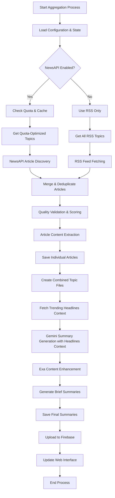

# News Aggregation Pipeline Flow

This document provides a comprehensive overview of the news aggregation pipeline, from initial article discovery through final AI-powered summary generation.

## Pipeline Overview

The pipeline consists of five main stages:

1. **🔍 Article Discovery & Selection** - Find and rank high-quality articles
2. **📄 Article Processing** - Extract content and validate quality
3. **📚 Content Aggregation** - Combine articles by topic
4. **🤖 AI Processing** - Generate summaries and detailed articles with Gemini
5. **💾 Storage & Distribution** - Save and serve content



## Stage 1: Article Discovery & Selection

### 1.1 Initialization & Configuration

**File**: `newsaggregator/core/aggregator.py`

```python
# Initialize system components
aggregator = NewsAggregator()
- Load RSS fetcher
- Initialize article processor  
- Setup Gemini processor
- Initialize enhanced article selector (with NewsAPI + caching)
- Connect to Firebase
```

**Configuration Loading**: `newsaggregator/config/settings.py`
- RSS feed URLs for each topic
- NewsAPI.org settings and quota limits
- Cache configuration
- Quality thresholds
- API keys and credentials

### 1.2 Topic Selection & Quota Management

**File**: `newsaggregator/selectors/article_selector.py`

```python
def get_quota_optimized_topics():
    # Check NewsAPI quota status
    # Prioritize topics based on remaining requests
    # Return optimized topic list
```

**Quota Manager**: `newsaggregator/utils/quota_manager.py`
- Tracks daily API request usage (80/100 limit)
- Enforces hourly rate limits (10 req/hour)
- Provides topic prioritization recommendations
- Maintains persistent quota state

### 1.3 Multi-Source Article Discovery

**Primary Source - NewsAPI.org**: `newsaggregator/fetchers/newsapi_fetcher.py`

```python
def get_curated_articles_for_topic(topic):
    # Check cache first
    cached_articles = cache.get_cached_articles(topic)
    if cached_articles:
        return cached_articles
    
    # Check quota before API call
    can_request = quota_manager.can_make_request()
    if not can_request:
        return []
    
    # Fetch from NewsAPI with intelligent endpoint selection
    if topic has category:
        articles = fetch_top_headlines(category, topic=topic)
    else:
        articles = fetch_everything(query, topic=topic)
    
    # Record request and cache results
    quota_manager.record_request()
    cache.cache_articles(articles)
    
    return scored_and_ranked_articles
```

**Fallback Source - RSS Feeds**: `newsaggregator/fetchers/rss_fetcher.py`

```python
def fetch_feed(feed_url):
    # Parse RSS feed
    # Extract article metadata (title, URL, date, source)
    # Return normalized entries
```

**Smart Caching**: `newsaggregator/utils/article_cache.py`
- 1-hour cache duration for API results
- Daily cache key rotation
- Automatic cleanup of expired files
- Reduces API calls by 60-80%

### 1.4 Article Ranking & Quality Assessment

**Multi-Factor Scoring Algorithm**:
- **Source Authority (40%)**: Reuters=100, BBC=90, CNN=85, etc.
- **Recency (25%)**: Fresh articles (<6hrs) get full points
- **Content Quality (30%)**: Title length, description, author presence
- **Additional Factors (5%)**: Images, source type, clickbait detection

**Quality Filtering**:
- Remove suspicious domains (blogspot, wordpress, etc.)
- Filter placeholder content
- Validate URL schemes
- Enforce minimum content requirements

## Stage 2: Article Processing

### 2.1 Content Extraction

**File**: `newsaggregator/processors/article_processor.py`

```python
def process_article(entry, topic):
    # Skip if already processed or recently failed
    if url in processed_urls:
        return None, False
    
    # Extract full article content
    content, date = article_fetcher.scrape_article_content(url)
    
    if content:
        # Save to file storage
        FileStorage.save_article(title, content, source, url, date, topic)
        
        # Append to combined topic file
        FileStorage.append_to_combined_file(article_data)
        
        # Mark as processed
        processed_urls.add(url)
        
        return article_data, True
```

**Content Extraction**: `newsaggregator/fetchers/article_fetcher.py`
- Handles Google News URL decoding
- Uses newspaper3k for content extraction
- Special handling for NYT archived articles
- Validates content length and quality
- Extracts publish dates and metadata

### 2.2 Deduplication & State Management

**Processed URL Tracking**:
- Maintains set of processed URLs to avoid duplicates
- Tracks failed URLs with retry intervals
- Persistent state across runs

**File Storage**: `newsaggregator/storage/file_storage.py`
- Individual article files: `data/latest_news_articles/{topic}/{timestamp}_{title}.txt`
- Combined topic files: `data/combined_articles/{topic}_combined.txt`
- Metadata and state files in `data/`

## Stage 3: Content Aggregation

### 3.1 Topic-Based File Combination

For each topic, all processed articles are combined into a single file:

```
File: data/combined_articles/TECHNOLOGY_combined.txt

=== Article 1 ===
Title: [Article Title]
Source: [Source Name]
URL: [Article URL]
Date: [Publication Date]

[Full Article Content]

=== Article 2 ===
[Next Article...]
```

This combined file serves as input for the AI processing stage.

### 3.2 Cross-Topic Deduplication

The system tracks articles across topics to avoid processing the same story multiple times, even if it appears in different topic feeds.

## Stage 4: AI Processing with Gemini

### 4.1 Headlines Context Collection

Before generating summaries, the system optionally fetches current trending headlines to provide Gemini with broader context about what's happening in the news landscape.

**File**: `newsaggregator/processors/gemini_processor.py`

```python
def get_trending_headlines_context(topic):
    # Check quota availability (need 5+ requests remaining)
    # Only fetch for priority topics (TOP_NEWS, TECHNOLOGY, BUSINESS)
    # Get 15 recent headlines from NewsAPI
    # Deduplicate similar headlines
    # Format for Gemini context
    
    return formatted_headlines_string
```

**Smart Quota Management**:
- Only fetches headlines for priority topics
- Requires minimum quota threshold (5 requests)
- Uses separate cache keys for headlines vs. articles
- Falls back gracefully if quota is low

**Headline Deduplication**:
- Removes headlines with 3+ common words (likely duplicates)
- Limits to 8 unique headlines per topic
- Prioritizes diverse headline sources

### 4.2 Summary Generation with Headlines Context

**File**: `newsaggregator/processors/gemini_processor.py`

```python
def generate_summary(content, topic):
    # Get trending headlines for additional context
    headlines_context = get_trending_headlines_context(topic)
    
    # Read combined topic file
    combined_content = read_combined_file(topic)
    
    # Generate comprehensive summary with Gemini
    if headlines_context:
        prompt = f"""
        Analyze these {topic} articles and create a comprehensive summary:
        - Main summary of key developments
        - Individual story breakdowns with titles and descriptions
        - Use the trending headlines below to prioritize important stories
        - Focus on topics that align with what's currently trending
        
        {headlines_context}
        
        News Articles: {combined_content}
        """
    else:
        prompt = f"""
        Analyze these {topic} articles and create a comprehensive summary:
        - Main summary of key developments
        - Individual story breakdowns with titles and descriptions
        
        News Articles: {combined_content}
        """
    
    response = gemini_model.generate_content(prompt)
    return parsed_summary_with_stories
```

**Headlines Context Enhancement**:
- Fetches current trending headlines from NewsAPI.org
- Only for priority topics to conserve quota (TOP_NEWS, TECHNOLOGY, BUSINESS)
- Deduplicates similar headlines to avoid noise
- Provides Gemini with current news landscape context
- Helps prioritize stories that align with breaking news and trends

**Summary Structure**:
```json
{
  "Summary": "Overall topic summary...",
  "Stories": [
    {
      "StoryTitle": "Individual story title",
      "StoryDescription": "Story details...", 
      "id": "unique_story_id"
    }
  ]
}
```

### 4.2 Content Enhancement with Exa

**File**: `newsaggregator/processors/article_processor.py`

```python
def process_for_summary(summary_data):
    for story in summary_data['Stories']:
        # Check for duplicates
        if not is_duplicate_article(story_title):
            # Fetch detailed content using Exa search
            detailed_article, citations, img_url = exa_fetcher.fetch_detailed_article(story_title)
            
            # Generate additional metadata
            story['FullArticle'] = detailed_article
            story['Citations'] = citations
            story['summary'] = generate_story_summary(detailed_article)
            story['keyPoints'] = extract_key_points(detailed_article)
            
            # Process images
            if img_url:
                r2_url = r2_storage.upload_image_from_url(img_url, story_title)
                story['img_url'] = r2_url
```

**Exa Integration**: `newsaggregator/fetchers/exa_fetcher.py`
- Searches for recent articles on specific story topics
- Aggregates content from multiple sources
- Provides citations and references
- Finds relevant images for stories

### 4.3 Brief Summary Generation

```python
def generate_brief_summary(full_summary, topic):
    prompt = f"""
    Create a brief, engaging summary of this {topic} news:
    - 2-3 sentences maximum
    - Focus on the most important developments
    - Include 3-5 bullet points of key highlights
    """
    
    return {
        'BriefSummary': brief_text,
        'BulletPoints': [key_points]
    }
```

## Stage 5: Storage & Distribution

### 5.1 File System Storage

**Summary Files**: `data/news_summaries/{topic}/{timestamp}_summary.json`

```json
{
  "topic": "TECHNOLOGY",
  "timestamp": 1703123456,
  "Summary": "Main summary text...",
  "brief_summary": "Brief version...",
  "bullet_points": ["Point 1", "Point 2"],
  "Stories": [
    {
      "StoryTitle": "Story title",
      "StoryDescription": "Description", 
      "FullArticle": "Complete article text",
      "Citations": ["source1", "source2"],
      "img_url": "https://r2.url/image.jpg",
      "summary": "Story summary",
      "keyPoints": ["Key point 1", "Key point 2"],
      "id": "unique_id"
    }
  ]
}
```

### 5.2 Firebase/Firestore Integration

**File**: `newsaggregator/storage/firebase_storage.py`

```python
def upload_to_firestore(summary, topic):
    # Upload main summary document
    doc_ref = db.collection('news_summaries').document()
    doc_ref.set(summary_data)
    
    # Upload individual articles
    for story in summary['Stories']:
        article_ref = db.collection('articles').document()
        article_ref.set(story_data)
```

**Firestore Collections**:
- `news_summaries`: Topic-level summaries
- `articles`: Individual story articles

### 5.3 Image Storage

**Cloudflare R2 Integration**: `newsaggregator/utils/r2_storage.py`
- Downloads images from article URLs
- Uploads to Cloudflare R2 storage
- Returns CDN URLs for fast delivery
- Handles image optimization and caching

### 5.4 Web Interface

**File**: `newsaggregator/web/app.py`

Flask web application that:
- Displays articles from Firestore
- Provides topic filtering
- Shows summaries and full articles
- Handles image display from R2 CDN

## Pipeline Execution Flow

### Complete Run Example

```bash
# Start aggregation process
python -m newsaggregator.core.aggregator

# Flow execution:
1. Load configuration and check NewsAPI quota (15 remaining requests)
2. Get quota-optimized topics: ['TOP_NEWS', 'TECHNOLOGY', 'BUSINESS'] 
3. Process TOP_NEWS:
   - Check cache: miss
   - Make NewsAPI request (14 remaining)
   - Find 25 articles, score and rank
   - Select top 20 articles
   - Extract content from 18 successfully
   - Save to files and update combined file
4. Process TECHNOLOGY:
   - Check cache: hit (from earlier run)
   - Use cached articles (no API request)
   - Process cached articles
5. Process BUSINESS:
   - Check cache: miss  
   - Make NewsAPI request (13 remaining)
   - Process articles
6. Generate summaries:
   - For TOP_NEWS: Fetch trending headlines for context (12 remaining)
     - Get 8 unique trending headlines
     - Include in Gemini prompt for better story prioritization
   - For TECHNOLOGY: Use cached headlines from earlier run
   - For BUSINESS: Fetch trending headlines for context (11 remaining)
   - Send enhanced prompts to Gemini for summary generation
   - Enhance stories with Exa content
   - Generate brief summaries and key points
   - Process and upload images to R2
7. Save and distribute:
   - Save summary files locally
   - Upload to Firestore
   - Update web interface
8. Complete: Used 4 API requests, processed 54 articles, generated 3 summaries with headlines context
```

### Performance Optimizations

**Caching Strategy**:
- NewsAPI results cached for 1 hour
- Gemini responses cached to avoid regeneration
- Image processing cached to R2

**Quota Management**:
- Daily limit: 80 requests (20% safety buffer)
- Hourly limit: 10 requests
- Priority topic processing
- Intelligent endpoint selection

**Quality Control**:
- Multi-stage article validation
- Duplicate detection across topics
- Source reliability scoring
- Content quality thresholds

## Monitoring & Maintenance

### Real-time Monitoring

```bash
# Check quota status
python monitor_quota.py

# Output:
📊 NewsAPI Quota Status
Daily Limit:      80
Requests Made:    12
Remaining:        68
Usage:            15.0%
Status:           🟢 Good

💾 Cache Statistics
Cache Enabled:    Yes
Total Files:      23
Total Articles:   287
Cache Hit Rate:   76%
```

### Error Handling & Recovery

- **Quota Exhaustion**: Automatic fallback to RSS feeds
- **API Failures**: Retry logic with exponential backoff
- **Content Extraction Failures**: Skip and continue processing
- **Storage Failures**: Multiple storage backends (file + cloud)

### Maintenance Tasks

- **Daily**: Monitor quota usage and cache performance
- **Weekly**: Clean expired cache files and old summaries  
- **Monthly**: Review source rankings and topic priorities
- **As needed**: Update API keys and configuration

This comprehensive pipeline ensures robust, high-quality news aggregation while staying within free tier API limits and maintaining excellent performance through intelligent caching and optimization strategies. 